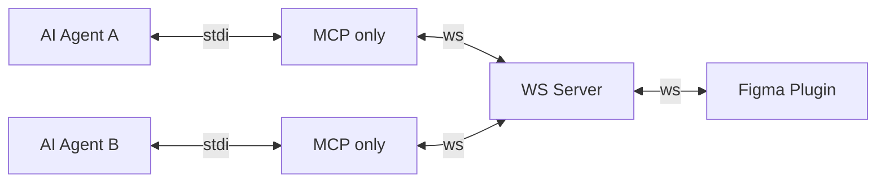

# figma-pilot-mcp

[](https://github.com/chicunic/figma-pilot-mcp)
[](./LICENSE)
[](https://bun.sh/)

An MCP server that gives AI full control over Figma — read, create, and modify designs with ease.

## Features

- **Full Figma Control**: Create, read, modify, and delete design elements
- **WebSocket Communication**: Real-time bidirectional communication between MCP server and Figma plugin
- **Batch Operations**: Execute multiple commands in sequence with result references
- **Flexible Deployment**: Run all-in-one, or split MCP and WebSocket into separate processes

## Prerequisites

- [Bun](https://bun.sh/) runtime
- [Figma Desktop](https://www.figma.com/downloads/) app

## Getting Started

1. **Install dependencies and build plugin**:

   ```bash
   bunx figma-pilot init
   ```

2. **Import plugin into Figma Desktop**:

   - **Plugins** → **Development** → **Import plugin from manifest...**
   - Select the `dist/plugin/manifest.json` in this project folder

3. **Configure your AI agent** (see [below](#configure-your-ai-agent))

4. **Run the plugin and connect**:

   - Open a design file in **Design mode**, run **Plugins** → **Development** → **Figma Pilot MCP**
   - The plugin UI shows a channel name (e.g., `figma-pilot-abc123`)
   - In your AI agent, use `pilot_connect` with the channel name

## Configure Your AI Agent

### Mode 1: All-in-one (recommended)


```jsonc
{
  "mcpServers": {
    "figma-pilot": {
      "command": "bunx",
      "args": ["figma-pilot", "start"]
    }
  }
}
```

### Mode 2: Separate WS + MCP (multi-agent)



1. **Start the WebSocket server**:

   ```bash
   bunx figma-pilot start --mode=ws
   ```

2. **Configure AI agents**:

   ```jsonc
   {
     "mcpServers": {
       "figma-pilot": {
         "command": "bunx",
         "args": ["figma-pilot", "start", "--mode=mcp"]
       }
     }
   }
   ```

## Reference

### Mode Summary

| Mode | CLI | MCP | WS Server | WS Client | Use Case |
| - | - | - | - | - | - |
| `all` | `--mode=all` | Yes | Yes | No | Single-agent |
| `mcp` | `--mode=mcp` | Yes | No | Yes | Multi-agent / remote WS |
| `ws` | `--mode=ws` | No | Yes | No | Standalone relay |

### CLI Commands

| Command | Description |
| - | - |
| `bunx figma-pilot init` | Install dependencies and build the plugin |
| `bunx figma-pilot build` | Rebuild the Figma plugin |
| `bunx figma-pilot start` | Start the server (default: all-in-one mode) |
| `bunx figma-pilot doctor` | Run diagnostics checks |

### Configuration

| Variable | Default | Description |
| - | - | - |
| `FIGMA_WS_PORT` | `3846` | WebSocket port |
| `FIGMA_WS_HOST` | `localhost` | WebSocket host |
| `FIGMA_REQUEST_TIMEOUT` | `30000` | Request timeout (ms) |
| `FIGMA_PILOT_MODE` | `write-only` | Tool mode: `write-only` / `read-write` |
| `FIGMA_RUN_MODE` | `all` | Run mode: `all` / `mcp` / `ws` |

## Available Tools

### Connection

| Tool | Description |
| - | - |
| `pilot_connect` | Connect to Figma plugin via WebSocket |
| `pilot_disconnect` | Disconnect from Figma plugin |
| `pilot_status` | Get WebSocket connection status |

### Creation

| Tool | Description |
| - | - |
| `pilot_create_shape` | Create shape (FRAME/RECTANGLE/ELLIPSE/POLYGON/STAR/LINE/VECTOR) |
| `pilot_create_text` | Create text node |
| `pilot_create_component` | Create empty component |
| `pilot_create_component_from_node` | Convert node to component |
| `pilot_create_instance` | Create component instance |
| `pilot_create_page` | Create new page |
| `pilot_create_section` | Create section |
| `pilot_create_slice` | Create export slice |
| `pilot_create_from_svg` | Create node from SVG string |
| `pilot_create_image` | Create image from base64 or URL (with optional filters) |
| `pilot_create_table` | Create table (FigJam) |
| `pilot_create_sticky` | Create FigJam sticky note |
| `pilot_create_connector` | Create FigJam connector between nodes |
| `pilot_create_shape_with_text` | Create FigJam shape with text |
| `pilot_create_node_tree` | Create nested node tree in one call |

### Text

| Tool | Description |
| - | - |
| `pilot_set_text` | Set text properties (content/font/color/spacing/align) [BATCH] |

### Modification

| Tool | Description |
| - | - |
| `pilot_set_fill` | Set fill: solid color or gradient [BATCH] |
| `pilot_set_stroke` | Set stroke: solid color or gradient [BATCH] |
| `pilot_set_corners` | Set corner radius (uniform or individual) [BATCH] |
| `pilot_move_node` | Move node to position |
| `pilot_resize_node` | Resize node [BATCH] |
| `pilot_set_rotation` | Set rotation [BATCH] |
| `pilot_set_opacity` | Set opacity [BATCH] |
| `pilot_set_blend_mode` | Set blend mode [BATCH] |
| `pilot_set_visible` | Set visibility [BATCH] |
| `pilot_set_locked` | Set locked state [BATCH] |
| `pilot_set_name` | Set node name |
| `pilot_set_effect` | Add shadow/blur or clear effects [BATCH] |
| `pilot_set_auto_layout` | Set auto layout on frame [BATCH] |
| `pilot_set_constraints` | Set constraints [BATCH] |
| `pilot_delete_node` | Delete node [BATCH] |
| `pilot_clone_node` | Clone node |
| `pilot_group_nodes` | Group nodes |
| `pilot_ungroup_node` | Ungroup node |
| `pilot_flatten_nodes` | Flatten to single vector |
| `pilot_boolean` | Boolean operation (UNION/SUBTRACT/INTERSECT/EXCLUDE) |
| `pilot_set_current_page` | Set current page |
| `pilot_set_viewport` | Set viewport center/zoom |
| `pilot_scroll_to_node` | Scroll to node |
| `pilot_set_selection` | Set selection |
| `pilot_notify` | Show notification |
| `pilot_set_image_fill` | Set image fill on node (hash/base64/URL) |
| `pilot_set_image_filters` | Set filters on existing IMAGE fill [BATCH] |

### Layout

| Tool | Description |
| - | - |
| `pilot_set_layout_child` | Set sizing/align/positioning for layout child [BATCH] |
| `pilot_set_layout_wrap` | Set layout wrap mode |
| `pilot_set_clips_content` | Set frame clips content [BATCH] |
| `pilot_set_overflow` | Set overflow direction [BATCH] |
| `pilot_set_guides` | Set guides on frame/page |

### Node Hierarchy

| Tool | Description |
| - | - |
| `pilot_move_child` | Append/insert/reorder child in parent |

### Instance Operations

| Tool | Description |
| - | - |
| `pilot_detach_instance` | Detach instance from component |
| `pilot_reset_overrides` | Reset instance overrides |
| `pilot_swap_component` | Swap instance to different component |

### Styles

| Tool | Description |
| - | - |
| `pilot_create_style` | Create paint/text/effect/grid style |
| `pilot_apply_style` | Apply style to node |
| `pilot_move_style` | Reorder style in list |

### Variables & Properties

| Tool | Description |
| - | - |
| `pilot_create_variable_collection` | Create variable collection |
| `pilot_create_variable` | Create variable |
| `pilot_set_variable_value` | Set variable value for mode |
| `pilot_create_variable_alias` | Create variable alias |
| `pilot_bind_variable` | Bind variable to property/paint/effect/grid |
| `pilot_set_component_properties` | Set instance properties |

### Team Library

| Tool | Description |
| - | - |
| `pilot_import_library` | Import component/style/variable from library |
| `pilot_import_style_by_key` | Import style by key |
| `pilot_import_variable_by_key` | Import variable by key |

### Export & Prototype

| Tool | Description |
| - | - |
| `pilot_set_export_settings` | Set export settings |
| `pilot_set_reactions` | Set prototype reactions |

### Reading

| Tool | Description |
| - | - |
| `pilot_get_node` | Get node info by ID (includes localPosition) |
| `pilot_get_selection` | Get current selection |
| `pilot_find_nodes` | Find nodes by type/name pattern |
| `pilot_get_children` | Get children of node |
| `pilot_get_top_frame` | Get top-level frame containing node |
| `pilot_get_current_page` | Get current page info |
| `pilot_get_pages` | Get all pages |
| `pilot_get_local_styles` | Get local styles |
| `pilot_get_local_components` | Get local components |
| `pilot_get_local_variables` | Get local variables |
| `pilot_get_variable_collections` | Get variable collections |
| `pilot_get_viewport` | Get current viewport |
| `pilot_export_node` | Export node as PNG/JPG/SVG/PDF |
| `pilot_get_component_properties` | Get component/instance properties |
| `pilot_get_export_settings` | Get export settings of node |
| `pilot_get_reactions` | Get prototype reactions of node |
| `pilot_get_library_variable_collections` | Get library variable collections |
| `pilot_get_library_variables` | Get library variables by collection |
| `pilot_get_component_set_variants` | Get variants of library component set |
| `pilot_get_image` | Get image info/bytes by hash |
| `pilot_list_available_fonts` | List available fonts (with search) |
| `pilot_get_selection_colors` | Get colors from selection |
| `pilot_parse_color` | Parse color string to RGB/RGBA |
| `pilot_get_event_subscriptions` | Get event subscription status |

### Events & Utilities

| Tool | Description |
| - | - |
| `pilot_event` | Subscribe/unsubscribe to events |
| `pilot_create_solid_paint` | Create solid paint object |
| `pilot_combine_as_variants` | Combine components as variants |

### Batch

| Tool | Description |
| - | - |
| `pilot_batch` | Execute multiple commands in sequence |

## License

MIT
